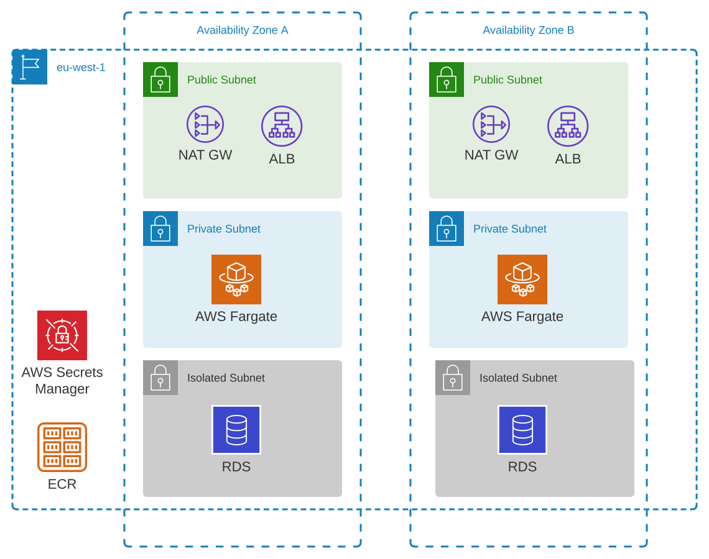

# rds-ecs-example

This is an example of Cloudformation stacks to run an app on ECS with RDS MySql as a database.

Cloudformation templates in this demo project are orchestrated with [Takomo](https://takomo.io/). 

## Overall architecture

RDS cluster is deployed in an isolated subnet without any access to the public internet. 
Fargate tasks are running in private subnets and can access other services over NAT gateway.
NAT GW and ALB are deployed in the public subnet. User password is generated by Secrets Manager
at the time when the Cloudformation stacks get deployed.

## How to spin up

1. Install nodejs
2. Clone this repo and do `npm install`
3. Authenticate your shell in AWS
4. Create a private ECR repository
5. Develop an app connecting to a Mysql
6. Fix the ECR path in templates/ecs.yml
7. Run `make deploy`

## Links

1. [Useful insights on Fargate networking for the engine version 1.4.0](https://stackoverflow.com/questions/61265108/aws-ecs-fargate-resourceinitializationerror-unable-to-pull-secrets-or-registry)
